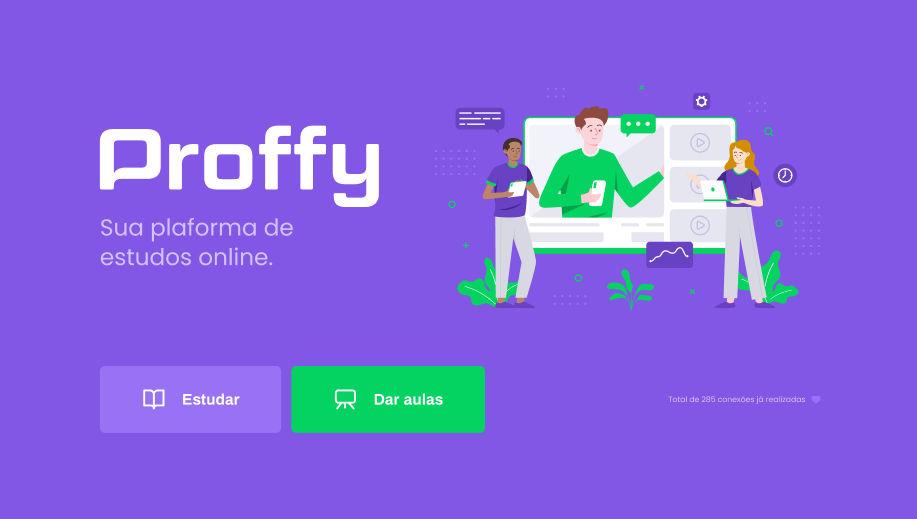
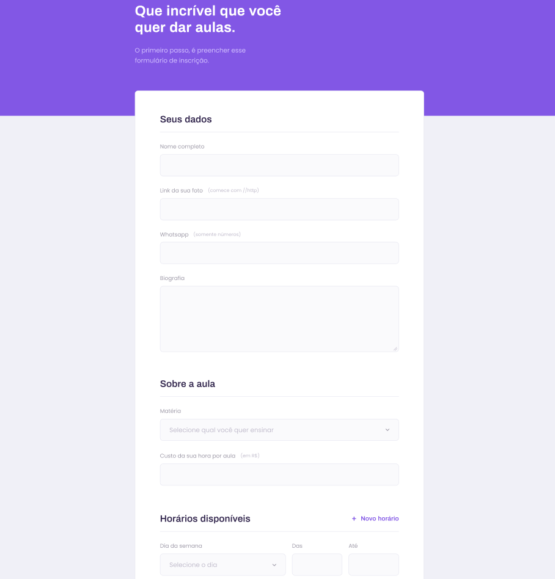
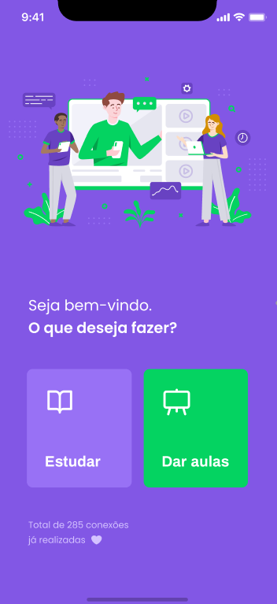

<h1 align="center">

</h1>

 
Uma aplicação web e mobile que tem como principal objetivo  conectar alunos e professores.

  

  

  

  

  

    <a href="#tecnologias">Tecnologias</a>&nbsp;&nbsp;&nbsp;|&nbsp;&nbsp;&nbsp;
  <a href="#iniciando-a-aplicação">Iniciando a aplicação</a>&nbsp;&nbsp;&nbsp;|&nbsp;&nbsp;&nbsp;
  <a href="#layout-da-aplicação">Layout da aplicação</a>&nbsp;
  &nbsp;&nbsp;|&nbsp;&nbsp;&nbsp;
  <a href="#license">License</a>&nbsp;&nbsp;&nbsp;|&nbsp;&nbsp;&nbsp;

## 🚀 Tecnologias

Estas foram as tecnologias utilizadas nesse projeto:

- 💹 **Node JS**
- ⚛️ **TypeScript**
- ⚛️ **React JS**
- ⚛️ **React Native**
- 📄 **SQLite**
- ♻️ **Expo**

## 🎨 Layout da aplicação

### Web

  
#### Tela Inicial

#### Tela de Cadastro

### Mobile

## 🧭 Iniciando a aplicação

1. Clone este repositorio usando `https://github.com/felipersdf/proffy.git`
2. Vá para a pasta raiz : `cd proffy` 
3. Use `yarn` para instalar as dependências 

### Iniciando o servidor backend

1. Vá para a pasta do backend: `cd server`  
2. Use `yarn dev` para iniciar o servidor
3. Use `yarn knex:migrate` para criar o banco de dados

### Iniciando o app no frontend

1. Vá para a pasta do frontend: `cd web`
2. Use `yarn start` para o iniciar o app web

### Iniciando o app mobile

1. Vá para a pasta do mobile: `cd mobile`
2. Use `react-native run-android` (ou `run-ios` se você possuir um iOs) para iniciar o aplicativo mobile

Nota: Se você escolher rodar no emulador android, você precisa iniciar o emulador antes de utilizar o comando `run-android`.

#### Utilizando o expo no seu celular

1. Instale o aplicativo Expo no seu celular (disponível na App Store [iOs] ou Google Play Store [Android] )
2. Use `yarn start`
3. Abra o Expo no seu celular e escaneie o QRCode.

## License

This project is licensed under the MIT License - see the [LICENSE](https://opensource.org/licenses/MIT) page for details.

All rights reserved to [RocketSeat](www.rocketseta.com.br)
